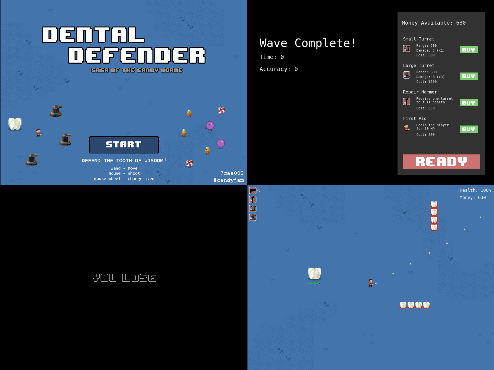

Dental Defender: Saga of the Candy Horde
========

An html5 shooter/tower defense game for the #candyjam

This project is forked from https://github.com/cshepp/candyjam , rewrote as typescript, update to Phaser 3 and using ES6 .

## Controls

move: `w` `s` `a` `d`

aim: mouse

shoot: `mouse-left`

select item: `1` `2` `3` `4`

## Video Demo

")